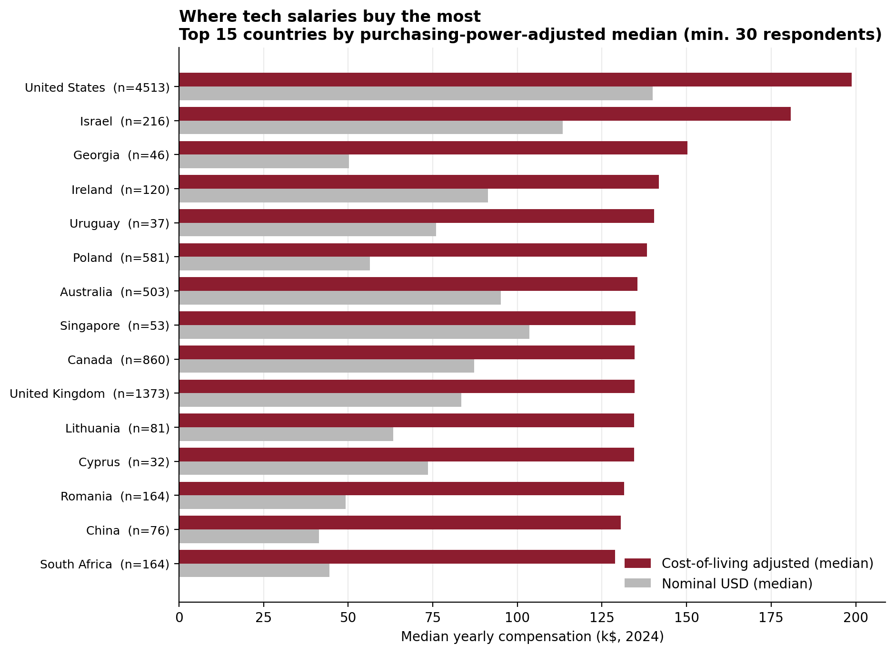
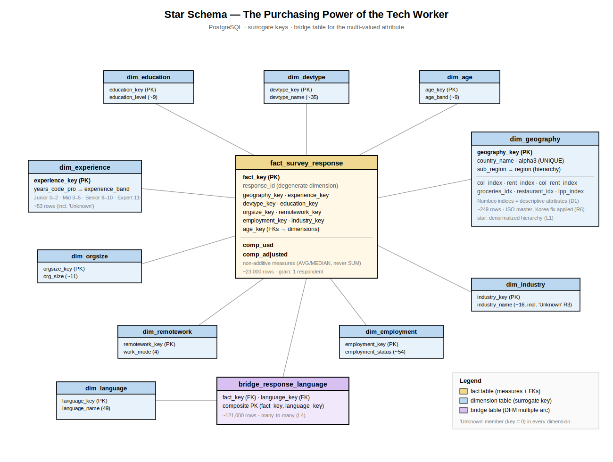

# The Purchasing Power of the Tech Worker

**A Data Warehousing project** — Data Management A.Y. 2025/26, Sapienza University of Rome ([DW] track)

**Authors:** Emanuele Smisi · Fabrizio Pietrobono

---

## Business question

*Where does a tech salary actually buy the most?*

A nominal salary is a misleading signal: 60,000 $ in Zurich and in Buenos Aires are two different lives. This project integrates three heterogeneous public sources into a star-schema data warehouse on PostgreSQL and answers the question with OLAP queries on cost-of-living-adjusted compensation.

**Headline findings:** the US leads even in real terms — but below the top the ranking reshuffles completely (Georgia 3rd, Poland 6th, ahead of Canada and the UK); Eastern Europe overtakes Western Europe in median real purchasing power; remote work acts as a multiplier, with a real-terms premium ranging from +57% (Americas) to +134% (Africa).



## Data sources

| Source | Role | Link |
|---|---|---|
| Stack Overflow Annual Developer Survey 2024 | Primary — facts (65,437 responses, grain: one respondent) | [Kaggle](https://www.kaggle.com/datasets/berkayalan/stack-overflow-annual-developer-survey-2024) |
| Country Mapping — ISO, Continent, Region | Geographic master — canonical key (ISO alpha-3) and hierarchy | [Kaggle](https://www.kaggle.com/datasets/andradaolteanu/country-mapping-iso-continent-region) |
| Cost of Living Index by Country 2024 (Numbeo) | Context — enables the adjusted measure | [Kaggle](https://www.kaggle.com/datasets/myrios/cost-of-living-index-by-country-by-number-2024) |

Raw data is **not** committed to this repository: the ETL script downloads it automatically via `kagglehub`.

## Architecture

```
Kaggle sources ──► EXTRACT ──► TRANSFORM ──► LOAD ──► PostgreSQL star schema ──► OLAP queries
 (kagglehub)                 (rules R1–R6,          (dims → facts → bridge,      (ROLLUP, window
                              ISO reconciliation,     surrogate keys, FKs)         functions,
                              derived measure)                                     percentile_cont)
```

- **Conceptual design:** Dimensional Fact Model (Golfarelli–Rizzi notation) — fact `SURVEY RESPONSE` at the finest grain, non-additive measures aggregated with medians, geographic and experience hierarchies, a multiple arc for the multi-valued languages attribute. See [`diagrams/DFM.svg`](diagrams/DFM.svg).
- **Logical design:** star schema — 1 fact table (~23k rows), 10 dimension tables with surrogate keys and explicit `'Unknown'` members, 1 bridge table (~121k rows). See [`diagrams/Star_Schema.svg`](diagrams/Star_Schema.svg).
- **ETL:** a single idempotent Python script; every transformation cites the documented design rule it implements (R1–R6, D1–D3, L1–L6).



## How to reproduce

Prerequisites: PostgreSQL running on `localhost:5432`, Python 3.9+.

```bash
# 1. create the database (once)
psql -c "CREATE DATABASE dw_techworker;"

# 2. install dependencies
pip install kagglehub pandas sqlalchemy psycopg2-binary

# 3. run the full pipeline (download → clean → load → quality check)
python etl/etl_dw_techworker.py

# 4. run the OLAP workload
psql -d dw_techworker -f sql/olap_queries.sql

# 5. (optional) live dashboard on top of the warehouse
pip install streamlit plotly
streamlit run demo_app.py
```

The script is **idempotent**: every run rebuilds the schema from scratch and ends with a quality-check report (row counts, NULL audit, smoke-test ranking). Note: the connection string at the top of `etl/etl_dw_techworker.py` assumes a local passwordless user — adjust it to your environment.

## Repository layout

| Path | Content |
|---|---|
| `etl/` | The ETL pipeline (extract → transform → load → quality check) |
| `sql/` | `olap_queries.sql` — the 8-query OLAP workload, each labelled with the OLAP operation it demonstrates; `demo_live.sql` — the 5-minute live-demo script |
| `diagrams/` | Design diagrams: DFM conceptual schema and star schema (SVG) |
| `charts/` | Result charts generated from the warehouse |
| `presentation/` | Slide deck (English) |
| `demo_app.py` | Minimal Streamlit dashboard on the live warehouse: choropleth map from ISO codes, nominal-vs-real ranking, and an interactive respondent-threshold slider that demonstrates rule R4 (thresholds live in queries, not in the ETL) |

## Design decisions worth noting

- **Reconciliation on codes, not names.** Country names are the only attribute shared by all three sources, but they are fragile join keys: both sources are mapped once onto the ISO master, and all joins happen on `alpha-3`. The master itself required validation — its row named *"South Korea"* carried `PRK`, North Korea's code (fixed in ETL).
- **The warehouse never loses information.** Cleaning removes only *wrong* data (implausible self-reported salaries, 1st–99th percentile trim); analytical choices such as the n ≥ 30 country threshold live in queries (`HAVING`), not in the ETL.
- **Non-additive measures.** Salaries are never summed: all aggregations use medians (`percentile_cont`), robust to the right-skewed distribution.
- **Declared limitations:** self-reported data, small samples for some top-ranked countries, country-grain cost indices, single-year snapshot (deliberately no time dimension).
